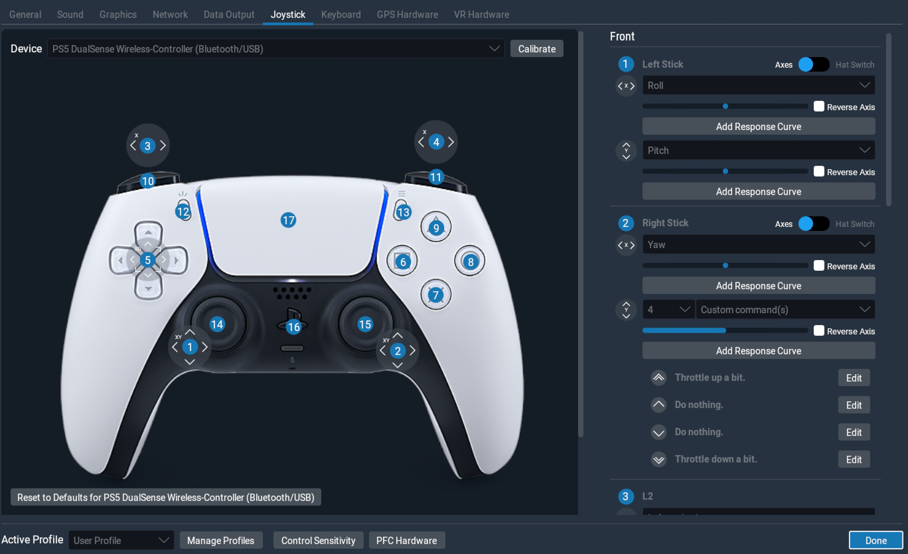

# Playstation 5 DualSense Wireless-Controller X-Plane .joy-File

Copy the files PS5 DualSense Wireless-Controller - Mac.joy and PS5 DualSense Wireless-Controll-Front.png to XPLANE/Resources/joystick configs/ and you should be able to visually configure the controller (either connected via Bluetooth or USB). 

I have setup some default assignments which I like the most:

**Left-Stick:** x=Roll/y=Pitch

**Left-Stick-Press:** Pitch trim down

**Right-Stick:** x=Yaw, y=Throttle up and down a bit

**Right-Stick-Press:** Pitch trim up

**Arrow-Buttons on the right:** Hat-Switch

**Action-Buttons on the left:** Move View left,right,up,down

**L2/R2:** Toe break left and right

**L1/R1:** Zoom out/in

For the other buttons I vary between quicklook-buttons/flaps and/or autopilot stuff.

Note that the Mic-Mute Button can only be used when connected via USB. The touch pad behaves like a regular button. Uncomment the "Button 14"-Settings in the joy-File.

## Important:
Note that it was setup to work on an Apple Mac! It would have to be adapted for other operating systems as the axis and button numbers might differ.

See also [Developer Documentation](https://developer.x-plane.com/article/creating-joystick-configuration-joy-files/) and [https://feedback.x-plane.com/posts/1430/ps4-ps5-controller-support](https://feedback.x-plane.com/posts/1430/ps4-ps5-controller-support)

Currently as of XPlane 11 the controller can be used, but needs to be configured manually. But without a .joy File X-Plane will not know that both sticks are centerable which limits the number of assigments that make sense.

All trademarks and images copyright by Sony.
